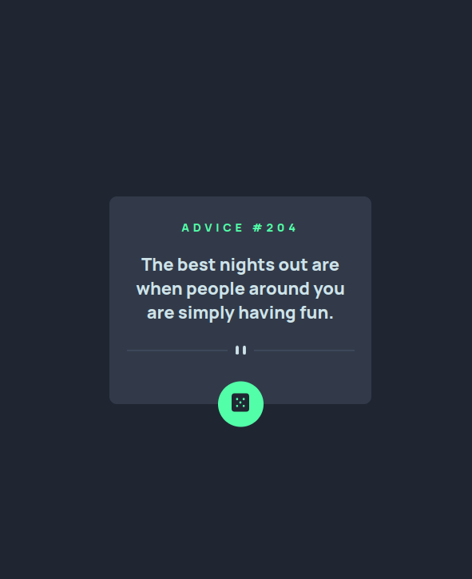

# Sobre Projeto:

## Projeto criado para treinar a funcionalidade de integração com uma API

Este projeto foi criado utilizando HTML, CSS e JavaScript.  

O objetivo do projeto é treinar como funciona a integração com uma API.
A API utilizada foi a [Conselho aleatório](https://api.adviceslip.com).  

Feita para conclusão da quest do curso [DevQuest](https://www.instagram.com/devemdobro/)

### Interessante:

O projeto é um gerador de conselhos.

O conselho é atualizado todas as vezes que clicado em gerar um novo conselho ou ao recarregar a página assim recebendo os dados da API.

O projeto é um exemplo de como integrar uma API a um site ou aplicativo.
 

Que você aprenda a integrar APIs com seus projetos. 
Que você aproveite este projeto como um exemplo para seus próprios projetos.

Baixe o código do projeto aqui: https://github.com/Willy-Braga/gerador-de-conselhos.   

Experimente o projeto em seu navegador.

## [Link do Projeto](https://willy-braga.github.io/gerador-de-conselhos/)

### Linguagens e Ferramentas

  
  
 

## Layout

### Desktop

### Mobile

### Contribua com o projeto

- Realize o Fork
- Faça as modificações necessárias
- Realize a Pull Request (PR)

### Fucionalidades do Projeto

- [x] Gerar Conselhos
- [x] Gerar novos conselhos

### Contribuidores

### Autor

[Licenca MIT License](http://creativecommons.org/licenses/by)
